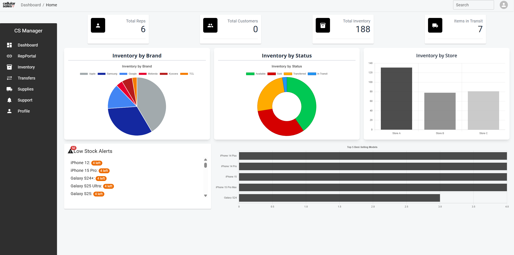

# Swing System App for Cellular Sales

# Tech used: [](https://skillicons.dev)

## Overview

A full-stack, real-time management system I built for a store I used to work at during my sales job at Cellular Sales. I wanted to rebuild and improve the internal system we used because it was outdated, slow, and caused a lot of confusion, especially around how we tracked customer swings and managed inventory.

This app fixes those problems. It includes a swing rep portal to assign customers fairly, real-time updates using Socket.IO, tools to manage and transfer inventory, the ability to order supplies directly into inventory, and a dashboard with charts and data to track performance. I built this to modernize how the store operates and make things way smoother for reps.

Please note that after periods of inactivity, the data and site may take a few seconds to load as the Render-hosted server wakes up from sleep mode.

## Testing 🚨 **Important** 

Since this is a demo version of the actualy application, here are testing emails:

test@test.com
test123

natelevi@cellularsales.com
Raygun11

brendenburns@cellularsales.com
testemail3

lewisporter@cellularsales.com
testemail4

johncrawford@cellularsales.com
testemail5

## Key Features

📊 Dashboard
Live analytics and charts for:
- Reps on sales floor
- Customer count
- Inventory trends
- Supply usage

👥 Rep Portal
- Real-time rep queue system ("swing system")
- Track customers helped per rep
- Auto-rotation with status updates ( First clocked in gets top of queue )

📦 Inventory Management
- View, add, edit, and transfer inventory between stores
- Supports detailed tracking of devices

📑 Supply Ordering
- Browse supply catalog from products
- Place timed orders (delayed fulfillment to simulate restocking window)
- Auto-adds to inventory when order is "fulfilled"

🔄 Inventory Transfers
- Transfer inventory between stores
- Status tracking and admin approval flow
- This system is Store A, which has the ability to recieve transfer to Store A

🆘 Internal Support System
- Submit support tickets

## Problem Statement
At Cellular Sales, we faced several challenges with our manual swing system:

❌ Confusion about rep rotation and customer assignment

❌ No centralized way to track or manage inventory and supplies

❌ Lack of visibility into key store performance data

❌ No internal support request system

❌ Fragmented or inconsistent store operations

Solution: The Store A Management System

This app provides a unified digital hub to support daily store operations, combining real-time queueing, inventory tracking, analytics, and support features into a single, modern interface.

## Tech Stack
Frontend: React, React Router, Material UI
Backend: Express.js, Node.js, Supabase (PostgreSQL), Firebase Auth
Real-Time: Socket.IO
Data: Day.js, Chart.js or Recharts
Auth: Firebase Admin SDK + JWT
Deployment: Render, netlify

### Installation
```bash
# Clone the repository

# Install dependencies
cd server && cd client npm install
npm install

# Start development server
npm run dev
```
